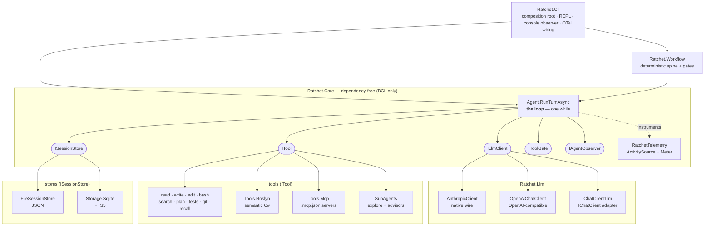
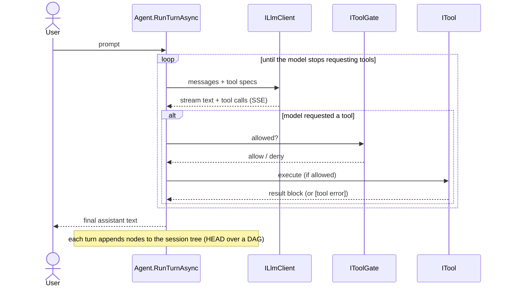
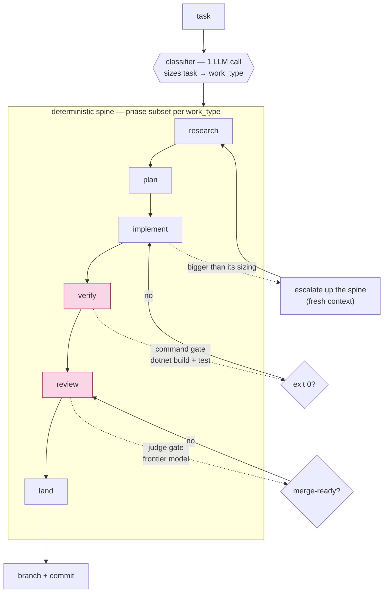

# Ratchet — a tiny .NET coding agent you can read

A deliberately small .NET 9 coding agent — a "pi-plain" port. **Four tools, one
loop, a hand-rolled Anthropic client.** The point is *understanding the agent loop at
the wire level*, not competing with Claude Code — and then growing it toward a real
agent **by hanging every feature off a seam**, so the loop's control flow stays
fixed. (Honesty note: `Core/Agent.cs` has been touched — a gate check in v0.9, telemetry
spans in v0.10–v0.11 — but the call/append/dispatch/repeat shape never changed; the
git history of that one file is the audit trail.)

> v0.1–v0.5 kept it stripped (no MCP, no Roslyn, no sub-agents). From v0.6 it grows
> along the seams the design always promised: `ILlmClient` now rides
> `Microsoft.Extensions.AI.IChatClient` (provider-agnostic), and `ITool` gains Roslyn,
> MCP, sub-agents/advisors, and skills — each in its own project so `Ratchet.Core`
> stays dependency-free. The loop's control flow, the session tree, and handover are unchanged.

The decisions behind the design are recorded as [Architecture Decision Records](docs/adr/README.md).

## 🏗️ Architecture Overview

One idea holds the whole project together: **the loop is immutable; everything grows
on a seam.** `Ratchet.Core` is dependency-free (BCL only) — it owns the loop and a
handful of interfaces. Every heavyweight capability (a provider client, a store, the
Roslyn/MCP tools, the workflow orchestrator) lives in its *own* project behind one of
those seams, and the CLI is the single composition root that wires concrete
implementations in.



### The loop

The entire agent is one `while` in `Core/Agent.cs` — read it first. A turn calls the
model, streams the reply, runs any tools the model asked for (each checked by the
permission gate first), appends the results, and repeats until the model stops asking
for tools. Everything else in this README is a thing that plugs into a seam *this loop
already calls*.



### The seams

Each interface is the exact point where a doc'd feature plugs in — and the reason the
project can grow toward the full Ratchet without a rewrite:

| Seam | What it abstracts | Implementations |
|---|---|---|
| `ILlmClient` | a model turn (build request, consume stream) | Anthropic native wire · `AnthropicChatClient` · `OpenAiChatClient` · `ChatClientLlm` (any `IChatClient`) |
| `ITool` | a callable tool + its JSON schema | read/write/edit/bash · search · plan · tests · git · recall · Roslyn · MCP · sub-agents |
| `ISessionStore` | persistence of the message tree | `FileSessionStore` (JSON) · `SqliteSessionStore` (incremental inserts, recursive-CTE path walks) |
| `ITextSearchableStore` | full-text search behind `recall` | SQLite FTS5 (file store falls back to an in-memory scan) |
| `IToolGate` | permission decision before a tool runs | `AllowAllGate` (default) · `ConsoleToolGate` · `ReadOnlyGate` (scopes delegated sub-agents) |
| `IAgentObserver` | per-token / per-event stream out of a turn | console renderer · audit logging / TUI / ACP later |
| `IWorkflowObserver` · `IRunStore` | record a workflow run's decisions | `WorkflowRun` + `FileRunStore` (`.ratchet/runs/<id>.json`) |

Because Core takes no dependencies, even the OpenTelemetry instrumentation lives there
on the **vendor-neutral BCL** `ActivitySource`/`Meter` — only the CLI references the
OTel SDK and wires exporters.

### Workflow orchestration

For larger tasks, run the agent through a fixed, ordered **spine** of phases instead
of one undifferentiated turn. The orchestrator is **deterministic** — it runs phases,
evaluates gates, and routes (advance / loop-back / escalate). LLM judgment shows up at
exactly two points: a one-call **classifier** that sizes the task into a `work_type`
(which phase subset runs), and **judge gates** that spend a frontier model on
merge-readiness an exit code can't express. **Command gates** route on a process exit
code — the cheapest, strongest judge there is. Floors (`verify`, `review`) always run.



Phase-to-phase context handoff *is* the v0.5 handover machinery (an authored doc +
`recall`), not a shared scratchpad. Each phase is its own `Agent` with its own role,
tool subset, model tier, and skills — so cheap models do the bulk and frontier spend
concentrates at the gates. Full design: [`docs/workflow-orchestration.md`](docs/workflow-orchestration.md).

## 🚀 Getting Started

### Prerequisites

- **.NET 9 SDK**
- An **Anthropic API key** (default provider) — or any of the providers in the table below
- *(optional)* an MCP-capable tool, a local model server (Ollama/LM Studio/vLLM), or an
  OTel collector for the extras

### Run it

```powershell
setx ANTHROPIC_API_KEY "sk-ant-..."   # once, then open a new terminal
cd C:\repos\private\Ratchet
dotnet run --project src/Ratchet.Cli
```

Drop an `AGENTS.md` in the working directory and it's prepended to the system prompt.
Try: *"create hello.txt with a haiku about warehouses, then read it back"*.

`ratchet --roslyn-check` runs the Roslyn tools against the current solution with no API
key (a self-test). Sessions auto-save to `.ratchet/sessions/` after each turn; `ratchet
-c` reopens the most recent. (Gitignore `.ratchet/` in real projects.)

### Providers — not tied to Anthropic

Pick the backend with `RATCHET_PROVIDER`; everything else (tools, sessions, workflows)
works the same regardless:

| `RATCHET_PROVIDER` | endpoint | key env | notes |
|---|---|---|---|
| `anthropic` *(default)* | Anthropic Messages API | `ANTHROPIC_API_KEY` | via `AnthropicChatClient` |
| `anthropic-native` | Anthropic Messages API | `ANTHROPIC_API_KEY` | hand-rolled wire `ILlmClient` |
| `openrouter` | `openrouter.ai/api/v1` | `OPENROUTER_API_KEY` (or `RATCHET_API_KEY`) | **one key, hundreds of models** |
| `openai` | `api.openai.com/v1` | `OPENAI_API_KEY` (or `RATCHET_API_KEY`) | |
| `groq` | `api.groq.com/openai/v1` | `GROQ_API_KEY` (or `RATCHET_API_KEY`) | |
| `local` / `ollama` | `RATCHET_LOCAL_BASE_URL` (default Ollama) | `RATCHET_LOCAL_API_KEY` (optional) | LM Studio / vLLM / llama.cpp |
| *anything else* | `RATCHET_BASE_URL` | `RATCHET_API_KEY` | any OpenAI-compatible endpoint |

Everything except Anthropic flows through one hand-rolled OpenAI-compatible client
(`Llm/OpenAiChatClient.cs`). For non-Anthropic providers set `RATCHET_MODEL` to that
backend's model id (e.g. OpenRouter `anthropic/claude-sonnet-4` or `openai/gpt-4o`;
Groq `llama-3.3-70b-versatile`). The same provider names work per-tier in a workflow's
`models:` block, so one run can mix a cheap `local` driver with an `openrouter` frontier
judge.

```powershell
$env:RATCHET_PROVIDER = "openrouter"
$env:OPENROUTER_API_KEY = "sk-or-..."
$env:RATCHET_MODEL = "anthropic/claude-sonnet-4"   # or openai/gpt-4o, google/gemini-2.5-pro, …
dotnet run --project src/Ratchet.Cli
```

**Which models are available?** `ratchet --models` queries every *configured* provider's
model-list endpoint and prints what each offers (so with a local server and OpenRouter both
set, you see both catalogs at once); `ratchet --models <substr>` filters. Individual agents
can then pick a backend per-agent via `provider:` / `model:` — see
[`docs/agent-teams.md`](docs/agent-teams.md).

### In-session commands

`/sessions`, `/resume <id>`, `/new`, `/model [id]` (show or switch the model mid-session —
`/model opus`, `/model openrouter:openai/gpt-4o`), `/tree` (show the branch tree), `/rewind [n]`
(move HEAD back n turns), `/goto <node>` (jump to a branch tip), `/handover` (write a
handover doc), `/handovers` (list them), `/compact` (fold this session into a handover
and continue fresh), `/help`.

### Environment knobs

| Variable | Effect |
|---|---|
| `RATCHET_MODEL` | model id (default `claude-sonnet-4-6`) |
| `RATCHET_SHELL` | shell the `bash` tool drives — `bash` / `cmd` / `pwsh` (default cmd on Windows, bash elsewhere) |
| `RATCHET_STORE` | `sqlite` switches the session store to one `.ratchet/ratchet.db` (default: JSON files) |
| `RATCHET_GATE` | `prompt` / `deny` turns on the permission gate for mutating tools (default: off, YOLO) |
| `RATCHET_RENDER` | `md` renders assistant replies as formatted markdown (ANSI: headings, bold, code fences, lists, tables, OSC 8 links). Each message is buffered and rendered whole when it completes, so live token streaming is traded away; unset keeps today's raw cyan streaming |
| `RATCHET_CONTEXT_LIMIT` | input-token threshold past which Ratchet auto-compacts into a self-handover |
| `RATCHET_PTY` | `1` opts the `bash` tool into a Windows ConPTY pseudo-console (a real TTY) |
| `RATCHET_TEST_CMD` | command `run_tests` invokes (default `dotnet test`) |
| `RATCHET_READ_MAX_BYTES` | cap on a single `read` (default 256 KB, then truncates with a notice) |
| `RATCHET_OTEL` | `console` / `otlp` enables OpenTelemetry export (default: off) |
| `OTEL_EXPORTER_OTLP_ENDPOINT` | OTLP target (default `http://localhost:4317`) |

## 🧰 Tools

Beyond the four primitives (`read` / `write` / `edit` / `bash`), these `ITool`s are
always on:

- **`search`** — read-only code search (regex content + filename glob), working-dir
  scoped. Also the only mutating-free tool the `explore` sub-agent gets.
- **`update_plan`** — an explicit, re-sent task checklist.
- **`run_tests`** — runs the suite (`dotnet test` by default, `RATCHET_TEST_CMD` to
  override) and returns a parsed pass/fail summary.
- **`git_status` / `git_diff`** — read-only repo awareness. `git_commit` /
  `git_create_branch` are mutating, so the permission gate governs them.
- **`recall`** — searches a prior session's cold-stored tree (FTS5 when on SQLite).
- **Roslyn** — semantic C#: diagnostics, find-symbol/references, outline, rename
  (MSBuildWorkspace). Lights up from the working solution.
- **MCP** — a `.mcp.json` connects MCP servers; each server tool becomes an `ITool`.
- **Sub-agents** — `explore` (a read-only investigator) and advisors, each a nested
  `Agent` behind the `delegate` tool.
- **`load_skill`** — `SKILL.md` discovery + progressive disclosure from
  `.ratchet/skills/<name>/` or `.claude/skills/…`.

The `edit` tool requires you to have read a file first and that its match be unique (or
pass `replace_all`).

## 🔄 Workflows (phased orchestration)

```powershell
ratchet --workflow workflows/ratchet-dev.yaml "add a --version flag to the CLI"
```

Every run is recorded to `.ratchet/runs/<id>.json` — the classification + reasoning,
the event trace, and **per-tier token cost** (so "are the cheap drivers actually
carrying the load?" is answerable). Inspect with `ratchet --runs` / `ratchet --run
<id>`. An interrupted run checkpoints after each phase and continues with `ratchet
--workflow-resume <id>`. `ratchet --routing-stats` aggregates the *promotion* rate per
`(work_type, phase)` so a wrong cheap default shows up and is retuned with a one-line
config diff. The full design and rationale is
[`docs/workflow-orchestration.md`](docs/workflow-orchestration.md); model routing is
[`docs/model-routing.md`](docs/model-routing.md).

## 📊 Observability (OpenTelemetry)

Instrumented with OpenTelemetry — **off by default**, opt in with `RATCHET_OTEL`:

```powershell
$env:RATCHET_OTEL = "console"   # print spans + metrics to stdout
$env:RATCHET_OTEL = "otlp"      # export to a collector (Jaeger/Tempo/Grafana/…)
$env:OTEL_EXPORTER_OTLP_ENDPOINT = "http://localhost:4317"   # otlp target (default)
```

It follows the OpenTelemetry **GenAI semantic conventions** (`gen_ai.*`), so any OTel
backend renders it natively. **Traces** nest into a tree: `workflow.run → phase →
agent.turn → chat {model}` / `execute_tool {name}` / `gate {kind}` — with
`gen_ai.provider.name`, `gen_ai.request.model`, token usage, finish reason, and
gate-denied flags. **Metrics**: `gen_ai.client.token.usage`,
`gen_ai.client.operation.duration`, `ratchet.tool.calls` / `ratchet.tool.duration`,
`ratchet.gate.denials`. The instrumentation lives in Core on the vendor-neutral BCL
diagnostics API (`RatchetTelemetry`), so it's **zero-cost when nothing is listening**
and Core takes no OpenTelemetry dependency — only the CLI wires the SDK + exporters.

## 💾 Storage

Swappable via `RATCHET_STORE`: unset (default) writes one JSON file per session under
`.ratchet/sessions/`; `sqlite` uses a single `.ratchet/ratchet.db` and inserts only new
nodes per turn (no full rewrite). Both implement the same `ISessionStore` seam. Resume
cold from a handover with `ratchet --handover <session-id>`: a fresh session that
carries the handover doc as its working set and gains a `recall` tool to page detail
back out of the prior session.

## 📂 Project Structure

```
Ratchet/
├── Ratchet.sln
│
├── docs/
│   ├── adr/                         # Architecture Decision Records (the "why")
│   ├── workflow-orchestration.md
│   └── model-routing.md
├── workflows/
│   └── ratchet-dev.yaml             # a concrete workflow instance
│
├── src/Ratchet.Core/               # dependency-free: the loop + the seams
│   ├── Agent.cs                     #   THE LOOP — read it first (one while)
│   ├── Conversation.cs             #   transcript + the four wire content-block shapes
│   ├── ILlmClient.cs · ITool.cs    #   the model + tool seams
│   ├── Tools.cs                     #   read / write / edit / bash
│   ├── SearchTool.cs               #   read-only regex + glob code search
│   ├── Sessions.cs                  #   session TREE (HEAD over a DAG) + JSON store
│   ├── Handover.cs · RecallTool.cs #   handover doc + retrieval back into cold storage
│   ├── SubAgents.cs                 #   delegate tool: a nested Agent (explore + advisors)
│   ├── Skills.cs                    #   SKILL.md discovery + load_skill
│   ├── PlanTool.cs · TestTool.cs   #   update_plan · run_tests
│   ├── GitTools.cs                  #   git_status / git_diff (+ gated commit/branch)
│   ├── ToolGate.cs                  #   IToolGate: AllowAll (default) / ReadOnly
│   ├── ProcessRunner.cs            #   kill-on-cancel + output-drain process helper
│   ├── FileAccessLog.cs            #   read-before-write guard for read/write/edit
│   ├── WindowsPty.cs                #   opt-in ConPTY pseudo-console for bash
│   └── RatchetTelemetry.cs         #   OTel instrumentation (BCL ActivitySource + Meter)
│
├── src/Ratchet.Llm/                # provider clients (behind ILlmClient)
│   ├── AnthropicClient.cs          #   wire-level Messages API (anthropic-native)
│   ├── AnthropicChatClient.cs      #   the same wire as a Microsoft.Extensions.AI IChatClient
│   ├── ChatClientLlm.cs            #   ILlmClient over any IChatClient (the adopt-IChatClient seam)
│   ├── OpenAiChatClient.cs         #   one hand-rolled OpenAI-compatible client (everything non-Anthropic)
│   └── CacheControl.cs             #   prompt-caching breakpoints
│
├── src/Ratchet.Storage.Sqlite/     # ISessionStore + ITextSearchableStore over SQLite/FTS5
├── src/Ratchet.Tools.Roslyn/       # semantic C# tools (MSBuildWorkspace)
├── src/Ratchet.Tools.Mcp/          # MCP servers from .mcp.json → ITools
│
├── src/Ratchet.Workflow/           # the orchestrator (above the loop, +YamlDotNet)
│   ├── WorkflowScheduler.cs        #   deterministic spine + gates + routing + promotion
│   ├── WorkflowLoader.cs · WorkflowConfig.cs   # YAML → validated domain model
│   ├── Classifier.cs               #   the one intake LLM call → work_type
│   ├── Gates.cs                     #   command gates + judge gates
│   ├── PhaseTools.cs               #   per-phase tool wiring + escalation/consult
│   ├── RunStore.cs · WorkflowRun.cs #  persisted run record + cost tally
│   └── MeteredLlmClient.cs         #   per-tier token accounting (transparent wrapper)
│
└── src/Ratchet.Cli/
    └── Program.cs                   # composition root: wiring + console observer + REPL
```

## 🎯 Key Design Decisions

The full reasoning — context, the alternative we rejected, and the consequences — lives
in [`docs/adr/`](docs/adr/README.md). The contested ones, mapped to the version they
landed in:

| Version | Decision |
|---|---|
| v0 / ongoing | [ADR-0001](docs/adr/0001-immutable-loop-grow-on-seams.md) the loop is immutable; all growth happens on seams · [ADR-0002](docs/adr/0002-core-stays-dependency-free.md) Core stays dependency-free; heavy deps in separate projects |
| v0.3 | [ADR-0003](docs/adr/0003-session-as-branch-tree.md) a session is a branch tree (HEAD over a DAG), the git model |
| v0.5 | [ADR-0004](docs/adr/0004-handover-not-compaction.md) retrieval-backed handover, never silent in-place compaction |
| v0.6 | [ADR-0005](docs/adr/0005-provider-agnostic-keep-native-wire.md) provider-agnostic via `IChatClient`, but keep the hand-rolled wire |
| v0.8 | [ADR-0006](docs/adr/0006-deterministic-orchestrator.md) deterministic orchestrator; LLM judgment only at classifier + judge gates |
| v0.10 | [ADR-0007](docs/adr/0007-two-layer-routing-not-a-router.md) two-layer model routing (predictive + reactive), not a router |
| v0.11 | [ADR-0008](docs/adr/0008-telemetry-on-bcl-in-core.md) telemetry on BCL diagnostics in Core; the SDK only in the CLI · [ADR-0009](docs/adr/0009-readonly-subagents-by-structure.md) YOLO by default, but sub-agents scoped read-only by structure |
| v0.12 | [ADR-0010](docs/adr/0010-stop-reason-policy-at-the-loop-boundary.md) a stop-reason policy at the loop boundary — the one deliberate loop edit, to keep the transcript valid when a response is cut off mid-tool-call |
| v0.13 | [ADR-0011](docs/adr/0011-delegation-family-one-seam.md) sub-agents, teams, and council are one seam at three altitudes; council keeps the human in the synthesis seat |

## 🚫 What it deliberately does NOT do

Still no **silent in-place compaction**: the long-session answer remains *handover*,
now also auto-triggered when context crosses `RATCHET_CONTEXT_LIMIT` (v0.7) — a
self-authored summary, never a quiet lossy truncation. The **permission gate** that was
the conspicuous gap now exists (v0.9, `IToolGate`) but is **off by default** — Ratchet
stays pi-plain YOLO unless you set `RATCHET_GATE=prompt` (or `deny`), at which point
mutating tools (`bash`, `write`, `edit`, `git_commit`, `git_create_branch`, the Roslyn
rename) require approval while read-only tools always pass.

YOLO is for the *top-level* agent, which you drive directly — but a **delegated** sub-agent
is scoped to its role regardless. The `explore` investigator runs under a deny-by-default
`ReadOnlyGate` with only read-only tools (`read` + a real read-only `search`), so it
**cannot** mutate even if prompted to — the constraint is enforced in the loop, not asked for
in its prompt.

## 📜 Version history

> **v0.1 — streaming.** Responses stream over SSE: assistant text appears
> token-by-token, and tool-call arguments are reassembled from `input_json_delta`
> fragments. See `Llm/AnthropicClient.ConsumeStreamAsync`.
>
> **v0.2 — sessions.** Conversations auto-save to `.ratchet/sessions/` after each
> turn (one JSON file each, same shape as the API wire format). `/sessions`,
> `/resume <id>`, and `ratchet -c` bring them back.
>
> **v0.3 — branch tree.** A session is a *tree* of message nodes with a HEAD
> pointer (the git model). `/rewind [n]` moves HEAD back whole turns; continuing
> forks a new branch while the old line is preserved. `/tree` visualises it,
> `/goto <node>` jumps between branch tips. Rewind is turn-level so HEAD always
> lands on a valid boundary.
>
> **v0.4 — SQLite store.** `SqliteSessionStore` (separate project, keeps Core
> dependency-free) implements `ISessionStore` over one `.ratchet/ratchet.db`.
> Nodes are append-only, so each turn inserts just the new rows instead of
> rewriting a whole file; recursive CTEs walk the parent chain. Opt in with
> `RATCHET_STORE=sqlite`.
>
> **v0.5 — handover (instead of compaction).** Long sessions are handled by
> *retrieval-backed handover*, not in-place summarisation. `/handover` has the
> model author a structured doc (goal · state · decisions · next steps · gotchas ·
> pointers) saved as editable Markdown under `.ratchet/handovers/`. `ratchet
> --handover <id>` then starts a **fresh** session with that doc injected as its
> working set, plus a `recall` tool that searches the prior session's full tree
> for detail the summary left out. Nothing is destroyed — old context is demoted
> to cold storage, and loss is *authored*, not silent. The generator rides on
> `ILlmClient`, `recall` rides on `ITool` + `ISessionStore`; the loop is untouched.
> When unattended runs eventually need it, compaction returns as an auto-triggered
> self-handover on the same machinery. Next rungs: a second `ILlmClient`; SQLite
> FTS behind `recall`.
>
> **v0.6 — IChatClient + the deferred elaborations.** The `ILlmClient` seam now has a
> second implementation, `ChatClientLlm`, backed by any `Microsoft.Extensions.AI`
> `IChatClient` — so Ratchet is provider-agnostic and MCP tools (which are `AITool`s)
> drop straight in. Anthropic flows through it via `AnthropicChatClient` (the same
> hand-rolled wire code, now speaking `IChatClient`); `RATCHET_PROVIDER=anthropic-native`
> still selects the original wire `ILlmClient`. On the `ITool` seam: **Roslyn**
> (`Tools.Roslyn`, semantic C# via MSBuildWorkspace), **MCP** (`Tools.Mcp`, `.mcp.json`),
> **sub-agents + advisors** (`Core/SubAgents.cs`, a tool that runs a nested `Agent`), and
> **skills** (`Core/Skills.cs`, SKILL.md progressive disclosure). Each heavy dependency sits
> in its own project; Core stays dependency-free. The loop, tree, and handover never changed —
> every addition landed on a seam, exactly as the growth path promised.
>
> **v0.7 — sharper tools, caching, and self-compaction.** A batch of elaborations, each on
> an existing seam, none touching the loop:
> - **Prompt caching.** Both Anthropic clients now stamp `cache_control` breakpoints on the
>   (stable) system prompt and tool specs and on the transcript tail, so unchanged prefixes are
>   read from cache instead of re-billed each turn. Lives entirely in `Llm/CacheControl.cs` +
>   the request builders.
> - **Auto self-compaction.** Set `RATCHET_CONTEXT_LIMIT` and, once a turn's input context
>   crosses it, Ratchet authors a handover and continues in a fresh session seeded with that doc
>   plus a `recall` tool over the archive — the v0.5 machinery, now self-triggered. `/compact`
>   does it on demand. "When unattended runs need it, compaction returns as an auto-triggered
>   self-handover," exactly as v0.5 promised.
> - **FTS-backed recall.** The SQLite store implements a new `ITextSearchableStore` seam (FTS5),
>   so `recall` searches in the database instead of loading the whole tree; the file store still
>   falls back to the in-memory scan. The seam is additive — no store is forced to implement it.
> - **A planning tool** (`update_plan`), a **test runner** (`run_tests`, parsed summary), and
>   **read-only git** (`git_status`/`git_diff`) — all plain `ITool`s.
> - **Edit guard.** `edit` now requires a prior read (shared `FileAccessLog`) and a unique match
>   (or `replace_all`) — no more blind, ambiguous edits.
> - **ConPTY shell.** An opt-in (`RATCHET_PTY=1`) Windows pseudo-console runner for `bash`
>   (`Core/WindowsPty.cs`, pure BCL P/Invoke). It gives the child a real TTY; because one-shot
>   *capture* through a pty is finicky (VT framing, render timing, nested consoles), it's opt-in
>   and the redirected-`Process` path stays the default. On a spawn failure it falls back to that
>   path; once a command has actually run under the pty it never re-runs it, so a side-effecting
>   command can't execute twice.
>
> Permission gates are still the conspicuous gap — the next rung, and the reason git here is
> read-only.
>
> **v0.8 — workflow orchestration.** A phased orchestrator on top of the loop
> (`src/Ratchet.Workflow`, +YamlDotNet; Core stays dependency-free). One LLM call at
> intake sizes the task into a `work_type`; a fixed, ordered spine then runs the selected
> phase subset, each phase its own `Agent` with its own role/tools/model-tier/skills. The
> scheduler is deterministic — it runs phases, evaluates **gates** (command gates route on
> an exit code; judge gates spend a frontier model on judgment an exit code can't express),
> and routes: pass advances, fail **loops back** (bounded), and a phase that proves bigger
> than its sizing **escalates** back up the spine. Floors (`verify`, `review`) always run.
> The phase-to-phase handoff *is* v0.5: an authored handover doc + `recall` into the prior
> phase's transcript. A second `ILlmClient` (`OpenAiChatClient`) lets cheap `local` driver
> tiers run on any OpenAI-compatible endpoint while frontier judges stay hosted. The intake
> classification, every gate outcome, each advisor consult, and advisor↔gate conflicts are
> recorded on the run, so a bad skip is diffable after the fact. Run it with
> `ratchet --workflow <file.yaml> "<task>"`; the design and the resolved open forks are in
> `docs/workflow-orchestration.md`. The agent loop, tree, and handover never changed — the
> orchestrator is plain control flow above the seams.
>
> **v0.9 — gates, run records, cost, resume, land.** Five elaborations that make the
> orchestrator trustworthy and close the "produces uncommitted diffs" gap:
> - **Permission gate** (`Core/ToolGate.cs`). An `IToolGate` consulted in
>   `Agent.ExecuteToolAsync` *before* a tool runs — a denial returns to the model as an
>   error result, not a crash, so the guarantee lives in the loop. Default `AllowAllGate`
>   (unchanged YOLO); `RATCHET_GATE=prompt|deny` turns it on for mutating tools. The REPL
>   agent and every workflow phase share it.
> - **Git write + a `land` phase.** `git_commit` / `git_create_branch` (mutating, so the
>   gate governs them) let the workflow actually *ship*: a terminal `land` phase branches
>   and commits the reviewed change instead of leaving a diff on the floor.
> - **Persisted run records** (`IRunStore` / `FileRunStore`). The classification, event
>   trace, and cost are written to `.ratchet/runs/<id>.json` — so "a bad skip is diffable
>   after the fact" is finally true, not a console line that scrolled away. `--runs` / `--run`.
> - **Per-tier cost accounting.** A `MeteredLlmClient` wraps every tier, so driver /
>   classifier / judge / advisor / handover tokens are tallied by tier with no call site
>   changes — making the "cheap drivers, frontier gates" economics measurable instead of
>   asserted.
> - **Resumable runs.** The scheduler checkpoints before each phase; a run interrupted by a
>   transient failure continues from the last good phase with `--workflow-resume <id>`,
>   without re-classifying or re-running completed phases — the prerequisite for unattended
>   runs. Each rides an existing seam — though this is the version where `Agent.cs`
>   itself first changed: the gate check in `ExecuteToolAsync` (a new seam, the move
>   ADR-0001 explicitly allows).
> - **Provider-agnostic.** `RATCHET_PROVIDER` now selects Anthropic, **OpenRouter** (one key,
>   hundreds of models), OpenAI, Groq, a local server, or any OpenAI-compatible endpoint via
>   `RATCHET_BASE_URL` — all through the existing `ILlmClient` seam (`OpenAiChatClient` for the
>   non-Anthropic wire). The same provider names work per-tier in a workflow, so one run can
>   mix a cheap local driver with an OpenRouter frontier judge. See the provider table above.
>
> **v0.10 — two-layer model routing** (`docs/model-routing.md`). Not a separate router — the
> orchestration already contained routing, in the form a coding agent wants:
> - **Predictive.** A phase's starting model tier resolves `work_type[phase].model →
>   spine[phase].driver → defaults.driver` — the same `(phase, work_type)` key the classifier
>   already chose and skills already use. No per-turn router, no extra inference tax.
> - **Reactive.** A `defaults.driver_ladder` turns the loop-back into a promotion: when a gate
>   goes red and a phase re-runs, its driver climbs one rung (a stronger driver changes the
>   work; consulting harder doesn't) — bounded by the same `max_loops` and the ladder top. A
>   `work_type` opts out with `promote: false`. Escalation does **not** promote; it stays the
>   distinct fresh-context re-frame.
> - **Feedback loop.** Promotions are recorded per `(work_type, phase)`; `ratchet
>   --routing-stats` aggregates the promotion rate across runs (escalations are counted
>   separately, not conflated), so a cheap default that's wrong shows up as a high rate and is
>   retuned with a one-line config diff — adaptation without a
>   learned black box. Why two layers beat a router *on its own turf*: coding has ground truth a
>   `dotnet test` away, so reacting to "did it pass" beats predicting "will it be hard", and the
>   decision stays diffable. Rides the existing scheduler; the loop's control flow is unchanged.
>
> **v0.11 — OpenTelemetry.** The agent is now observable. Instrumentation lives in Core on the
> vendor-neutral BCL diagnostics API (`Core/RatchetTelemetry.cs`: one `ActivitySource` + one
> `Meter`), so it's zero-cost when nothing listens and **Core keeps its no-dependency rule** —
> only the CLI takes the OpenTelemetry SDK and wires exporters (`RATCHET_OTEL=console|otlp`).
> Spans follow the GenAI semantic conventions and nest into a real trace tree — `workflow.run →
> classify / phase → agent.turn → chat {model}` / `execute_tool {name}` / `gate {kind}` — with
> `gen_ai.provider.name`/`gen_ai.request.model`/token-usage/finish-reason/gate-denied attributes;
> metrics cover token usage, model + tool durations, tool calls, and gate denials. The
> LLM-client span sits where the model name is known (`ChatClientLlm`, `AnthropicClient`); the
> turn/tool/gate spans in the loop; the run/phase/gate spans in the scheduler — each on the seam
> it belongs to. The turn/tool/gate spans are in-loop additions to `Agent.cs` — instrumentation,
> not control flow, but "untouched" would overstate it. This version also bundles the full-solution
> review fixes and the read-only sub-agent scoping (`ReadOnlyGate` + a read-only `search`).
>
> **v0.12 — trust: tests, hardening, and the thinking round-trip.** A full external review
> drove this release; the theme is *survives failure*, not new surface. A `tests/Ratchet.Tests`
> project (xUnit) and a GitHub Actions CI gate land first — the earlier "verified by a
> deterministic harness" doc claims are now backed by ~136 tests (a scripted `ILlmClient`, canned
> SSE streams, table-driven loader/store cases), and CI already caught a CRLF-only test bug. Then
> the substrate is hardened along every seam the loop already calls:
> - **Wire layer.** A typed `LlmException` (status · provider error type · retryable) with
>   exponential backoff honouring `Retry-After`; all three streaming clients now *throw* on a
>   stream that ends before `message_stop`/`[DONE]` instead of reporting a truncated answer as
>   success; `HttpClient.Timeout` is infinite for streaming with a per-read idle guard;
>   `ChatClientLlm` propagates the real finish reason so `max_tokens` truncation is visible.
> - **The loop's one invariant** ([ADR-0010](docs/adr/0010-stop-reason-policy-at-the-loop-boundary.md)):
>   a non-`tool_use` stop that still carries `tool_use` blocks (e.g. `max_tokens` mid-call) gets
>   them closed with error results, so the transcript stays API-valid instead of 400ing every
>   later call — the one deliberate loop edit, taken under ADR-0001's escape hatch. Cancellation
>   propagates promptly; a truncated/empty handover refuses loudly (ADR-0004).
> - **Durability + persistence.** A new `IAgentObserver.OnMessageAppended` seam lets a host
>   checkpoint turn progress, so a mid-turn failure no longer drops completed tool work; session
>   and handover saves are atomic (temp + rename); `SessionTree.FromNodes` validates structure
>   (dangling parents, cycles) and a corrupt/unrecognised file refuses rather than loading as an
>   empty tree the next save overwrites. The SQLite store's FTS index can no longer desync from
>   `nodes` (conditional inserts, per-row backfill), serializes on one lock, escapes LIKE
>   wildcards, and carries a `user_version` schema gate.
> - **Process substrate.** Bounded head+tail output (no context blowups), default timeouts with
>   process-tree kill (Process *and* the ConPTY path via a Job Object), stdin closed so prompts
>   fail fast, correct cmd.exe quoting, BOM/UTF-16-preserving edits with a CRLF fallback, binary
>   detection, and `read` paging (offset/limit).
> - **Workflow circuits.** A red gate's reason now reaches the retry prompt (and survives resume),
>   the review judge sees the real `git diff` not just the driver's self-summary, the `verify`
>   floor runs `dotnet test`, and gate outcomes are structured (no substring parsing).
> - **New capability, on the seams.** Thinking-block round-trip — extended-thinking models parse,
>   persist, and replay their `thinking`/`redacted_thinking` blocks verbatim (signature intact),
>   so Ratchet can drive a thinking-enabled model; and the `explore` sub-agent's reads are now
>   *scoped* to the workspace, making [ADR-0009](docs/adr/0009-readonly-subagents-by-structure.md)'s
>   "scoped by structure" true in mechanism, not just by gate. The loop's control flow is unchanged;
>   everything else grew on a seam, exactly as the design always promised.
>
> **v0.13 — the delegation family: sub-agents, teams, and council.** One seam
> (`DelegateTool`, a nested `Agent`) at three altitudes, all defined by the same
> Claude-Code-compatible agent file (`.claude/agents` / `.ratchet/agents`; frontmatter
> `name`/`description`/`tools`/`model`, prompt body). A file with no `members` is a **sub-agent**
> (loaded, not hardcoded — the old `explore`/advisors generalize); with `members:` it's a **team**
> that dispatches to all members *in parallel* and optionally has a lead synthesize; with
> `members:` + `mode: council` it's **council mode** — a deliberation harness for architectural
> decisions with no prior art. Council dispatches independent personas *cold to each other*, a
> clerk organizes their *locked* outputs into an Analysis Brief (Consensus / Contradictions /
> Partial coverage / Unique insights / Blind spots), and a **Decision Record** template is written
> to `.ratchet/council/` for a human — the council organizes, the human decides. A built-in
> **`council`** tool also convenes an *ad-hoc* deliberation with the roster named in the call, no
> file needed. Per-member
> `model:` routing gives the multi-model "Council of Reeds" through the provider seam; the built-in
> architect/skeptic/developer/domain personas work out of the box. New safety rails ride existing
> seams — a nesting-depth guard and a per-delegate iteration budget (via the observer), plus
> lock-guarded parallel cost metering. The loop is untouched
> ([ADR-0011](docs/adr/0011-delegation-family-one-seam.md); design in
> [`docs/agent-teams.md`](docs/agent-teams.md)).

## 🛠️ Technologies

- **.NET 9 / C#** — `Ratchet.Core` is BCL-only by rule
- **Anthropic Messages API** — hand-rolled wire client (JSON + SSE), the pedagogical core
- **Microsoft.Extensions.AI** (`IChatClient`) — the provider-agnostic seam
- **OpenAI-compatible wire** — one client for OpenRouter / OpenAI / Groq / local / any `/v1`
- **Roslyn** (MSBuildWorkspace) — semantic C# tools
- **Model Context Protocol (MCP)** — `.mcp.json` servers as tools
- **Microsoft.Data.Sqlite** (+ FTS5) — the optional session store and `recall` index
- **YamlDotNet** — workflow definitions
- **OpenTelemetry** (GenAI semantic conventions) — traces + metrics, SDK wired in the CLI only
- **Windows ConPTY** (P/Invoke) — opt-in pseudo-console for `bash`

## Namespacing

`CodeStack.Ratchet.*` namespaces, company-prefix-free assembly names
(`Ratchet.Core.dll`), matching the convention in the Forgewright repo.
